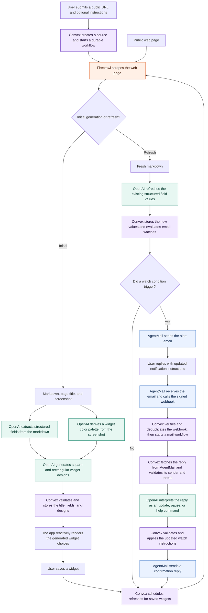

# Widget Now

Sick of always checking the same sites over and over again for updates? Widget Now lets you turn any webpage into a live widget, and get notified when the data changes.

### [Try it out here!](https://brave-hornet-708.convex.site/)

---

*Made for the Convex All Gas Hackathon*

---

## How it works

